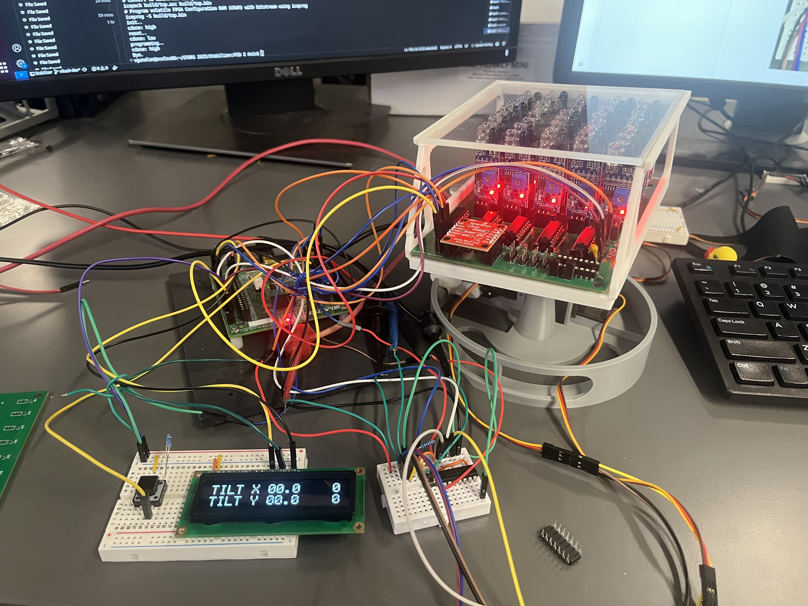
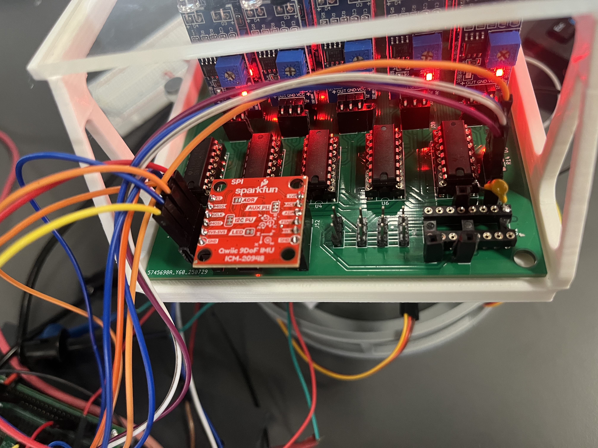
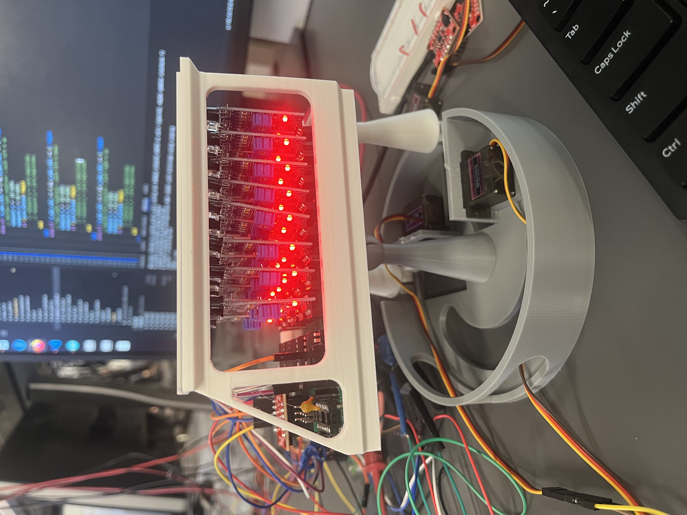

# NEBULA III - Project Documentation

## Team 02 - STARS Stabilizers
* **Peer Mentor:** Johnny Hazboun
* Vikash Gunalan
* Soumil Verma

## Project Overview
We present Polaris! Polaris is a 2D Ball Balancer that was designed by STARS 2025 Team 2 by Vikash and Soumil.

## Pin Layout
Note that on the final chip, there are 38 GPIO pins of which you have access to 34. The first number represents the GPIO on the physical chip, while the second number (in brackets) represents the number in your Verilog code. For each pin, mention if it is an input, output, or both and describe the pin function.
The layout pins will be in the form of the ICE40 FPGA. Note that this is only functional with the shield off.

* **Pin 00 [00]** - Not used
* **Pin 01 [--]** - NOT ALLOWED
* **Pin 02 [--]** - NOT ALLOWED
* **Pin 03 [--]** - NOT ALLOWED
* **Pin 04 [--]** - NOT ALLOWED
* **Pin 05 [01]** - Input (pb[18]) - IMU Enable
* **Pin 06 [02]** - Input (pb[1]) - Serial Data Out from IMU
* **Pin 07 [03]** - Output (left[2]) - CS into IMU 
* **Pin 08 [04]** - Output (left[0]) - Serial Data Into IMU 
* **Pin 09 [05]** - Output (left[1]) - SCLK into IMU
* **Pin 10 [06]** - Input (pb[2]) - SDI from shift register
* **Pin 11 [07]** - Output (right[4]) - SCLK into shift register
* **Pin 12 [08]** - Output (right[5]) - Latch for shift register
* **Pin 13 [09]** - Output (right[2]) - PWM X out 
* **Pin 14 [10]** - Output (right[3]) - PWM Y out 
* **Pin 15 [11]** - Output (ss0[1]) - CS into LCD 
* **Pin 16 [12]** - Output (right[0]) - SDO into LCD 
* **Pin 17 [13]** - Output (ss0[7]) - SCLK into SSD 
* **Pin 18 [14]** - Not used 
* **Pin 19 [15]** - Not used 
* **Pin 20 [16]** - Not used 
* **Pin 21 [17]** - Not used 
* **Pin 22 [18]** - Not used 
* **Pin 23 [19]** - Not used 
* **Pin 24 [20]** - Not used 
* **Pin 25 [21]** - Not used 
* **Pin 26 [22]** - Not used 
* **Pin 27 [23]** - Not used 
* **Pin 28 [24]** - Not used 
* **Pin 29 [25]** - Not used
* **Pin 30 [26]** - Not used
* **Pin 31 [27]** - Not used
* **Pin 32 [28]** - Not used
* **Pin 33 [29]** - Not used
* **Pin 34 [30]** - Not used
* **Pin 35 [31]** - Not used
* **Pin 36 [32]** - Not used
* **Pin 37 [33]** - Not used

## External Hardware

3D Printed Components: Seen above.
LCD Display: TFT 1602, Seen above.
Custom PCB:

IMU: ICM-20948
https://invensense.tdk.com/wp-content/uploads/2024/03/DS-000189-ICM-20948-v1.6.pdf 
IR Sensor: MH Flying Fish
Shift Registers: SNx4AHC125 Quadruple Bus Buffer Gates With 3-State Outputs                                                                                                                                              
https://www.ti.com/lit/ds/symlink/sn74ahc125.pdf 
Level Shifter: SNx4HC125 Quadruple Buffers with 3-State Outputs
https://www.ti.com/lit/ds/symlink/sn74hc125.pdf?ts=1754597629858&ref_url=https%253A%252F%252Fwww.ti.com%252Fproduct%252FSN74HC125 

Breadboarding / Wiring

 

## Functionality Description and Testing
This project is automatic! All the user has to do is turn it on with the “enable” button and reset it if they want to. After that simply, place a ping pong ball on the platform (or lightly lob it onto the platform) and the platform will adjust to try to bring it to the center. If it is unable to, adjust the setpoint and PID gains. 

## RTL Diagrams
Include more than just block diagrams, including sub-block diagrams, state-transition diagrams, flowcharts, and timing diagrams. Please include any images or documents of these inside this folder (docs/team_02).
