# NEBULA III - Project Documentation

## Team 05 - Biggie Smalls
* **Peer Mentor:** Alexander Weyer
* Divine Testimony
* Laura van Ritbergen
* Luke Ferrer
* Surrell Taylor
* Van Brown

## Project Overview
This project implements file compression and decompression in hardware with the Huffman Encoding/Decoding Algorithm. Given an input text file from an SD card peripheral, it may be compressed or decompressed based on the user's input. A physical interface which displays the file compression and decompression processes is implemented with LCD peripherals.  

## Pin Layout
Note that on the final chip, there are 38 GPIO pins of which you have access to 34.
The first number represents the GPIO on the physical chip, while the second number (in brackets) represents the number in your Verilog code. For each pin, mention if it is an input, output, or both and describe the pin function.

* **Pin 00 [00]** - Input or Output? - Pin Function?
* **Pin 01 [--]** - NOT ALLOWED
* **Pin 02 [--]** - NOT ALLOWED
* **Pin 03 [--]** - NOT ALLOWED
* **Pin 04 [--]** - NOT ALLOWED
* **Pin 05 [01]** - Output - writeBit_TL
* **Pin 06 [02]** - Input - esp_ack 
* **Pin 07 [03]** - Input - read_in_pulse
* **Pin 08 [04]** - Input - in[0]
* **Pin 09 [05]** - Input - in[1] 
* **Pin 10 [06]** - Input - in[2]
* **Pin 11 [07]** - Input - in[3]
* **Pin 12 [08]** - Input - in[4]
* **Pin 13 [09]** - Input - in[5] 
* **Pin 14 [10]** - Input - in[6] 
* **Pin 15 [11]** - Input or Output? - Pin Function? 
* **Pin 16 [12]** - Input or Output? - Pin Function? 
* **Pin 17 [13]** - Input or Output? - Pin Function? 
* **Pin 18 [14]** - Input or Output? - Pin Function? 
* **Pin 19 [15]** - Input or Output? - Pin Function? 
* **Pin 20 [16]** - Input or Output? - Pin Function? 
* **Pin 21 [17]** - Input or Output? - Pin Function? 
* **Pin 22 [18]** - Input or Output? - Pin Function? 
* **Pin 23 [19]** - Input or Output? - Pin Function? 
* **Pin 24 [20]** - Input or Output? - Pin Function? 
* **Pin 25 [21]** - Input or Output? - Pin Function? 
* **Pin 26 [22]** - Input or Output? - Pin Function? 
* **Pin 27 [23]** - Input or Output? - Pin Function? 
* **Pin 28 [24]** - Input or Output? - Pin Function? 
* **Pin 29 [25]** - Input or Output? - Pin Function?
* **Pin 30 [26]** - Input or Output? - Pin Function?
* **Pin 31 [27]** - Input or Output? - Pin Function?
* **Pin 32 [28]** - Input or Output? - Pin Function?
* **Pin 33 [29]** - Input or Output? - Pin Function?
* **Pin 34 [30]** - Input or Output? - Pin Function?
* **Pin 35 [31]** - Input or Output? - Pin Function?
* **Pin 36 [32]** - Input or Output? - Pin Function?
* **Pin 37 [33]** - Input or Output? - Pin Function?

## External Hardware
List all the required external hardware components and upload a breadboard with the equipment set up (recommend using Tinkercad circuits if possible).
### SD Cards (x2) 
Two micro-SD cards are used for reading and writing files.
Product Link: 

### Micro-SD Breakout Boards (x2)
Used to connect the micro-SD cards to the breadboard.
Product Link: https://www.adafruit.com/product/254?gad_source=1&gad_campaignid=21079227318&gclid=CjwKCAjw-svEBhB6EiwAEzSdrlKv_9erB0mv_1FO6r7wPmKpIe0ngq9ml7zTtjgyD5Iac6_eAgcsphoC2ioQAvD_BwE 

### ESP32

### LCD
The Liquid Crystal Display (LCD) is a type of display that is commonly used in electronics and hardware projects. This project uses the LCD to create a user interface which allows for selection between file compression and decompression on an SD, and the current state of the process.
Product Link: 

## Functionality Description and Testing
This project consists of both modules with implement the Huffman Algorithm, and interfacing modules for the SRAM and SD card (SPI). Compression and Decompression Processes are display on LCD and VGA displays.

### LCD Interface
#### Driver Module (t05_driver_1602.sv)
The Driver Module sets up all the components of the LCD display

#### LCD Module (t05_lcd.sv)
The LCD Module changes what is being displayed on the LCD display. 

### SPI
The Serial Peripheral Interface (SPI) is a standard protocol for interacting with microcontrollers/peripherals. This module is necessary to interface with this design's main peripheral: an SD card. It stores and sends SD file data to and from the working modules. MISO (Master in Slave out) is used to send data outputted from the SD to the SPI (read). This read data is sent from the SPI to the modules in parallel (8 bits at a time). MOSI (Master our Slave in) is used to send data outputted from the working modules and SPI to the SD card (write). This write data is sent from the modules to the SPI serially.

### Compression Modules
  
All src modules may be found in ~/verilog/rtl/team_projects/team_05/src. All testbench modules may be found in ~/verilog/dv/team_05/module_tests.

#### Compression SRAM interface (t05_sram_interface.sv)

An explicit state for each of the following modules (except header synthesis) is created for storing and retrieving information from the SRAM.

- Histogram Module - [128][32] array to store the occurrences for each ASCII character from the input file. Memory Allocation is 128 (words).
- Find Least Value - Does not store data in SRAM. Retrieves elements from the histogram array stored in SRAM.
- HTree - [128][64] array to store the Huffman Binary Tree 256 (words).
- Codebook Synthesis - Retrieves HTree elements from SRAM. A [128][128] array to store a maximum of 128 paths and a maximum height of 128 bits.
- Translation - Does not store data in SRAM. Retrieves path elements from the codebook array stored in SRAM.

#### Histogram Module (t05_histogram.sv)
Reads each 1 byte character from the SD card via the SPI, retrieves the stored occurrences of each character in SRAM, and updates the occurrences for that character. After reading through the file, an array of occurrences with 128 elements. Each index of the array corresponds to its 7-bit input.

#### Find Least Value Module (t05_findLeastValue.sv)
Works in parallel with the Huffman Tree Creation Module (HTree). It searches through the character occurrences of the histogram array stored in SRAM and the sums of characters from the Huffman Tree stored in SRAM to output the two character or sum indexes with the lowest values. The character indexes that are found have their occurrence values nullified so they are skipped in the next search. These two indexes are sent to Htree. 

#### Huffman Tree Module (t05_htree.sv)
Constructs a binary tree where each node consists of two children: either a leaf (character) or a nonleaf (sum of multiple characters) node based on the output of the find least value module. the sum of the 2 children is also stored in that node. Each node is a concatenated bitstream with the format {9'bCHILD1, 9'bCHILD2, 46'bSUM}. CHILD1 and CHILD2 consist of a leading bit "0" as the MSB followed by the 8 bit ASCII character representation, or if the child is a SUM: a leading bit of "1" and an 8 bit index that "points to" the element that has that sum. HTree will also nullify the sum of a node if that sum was found as one of the least occurrences in the find least value module.

#### Codebook Synthesis Module (t05_cb_synthesis.sv)
Traverses the Huffman Binary Tree stored in SRAM by accessing the children of each node and keeping track of the current path with a bitstream. The tree traversal follows a consistent post-order traversal algorithm: start at the top of the tree to move left by shifting in a "0" as the LSB until a leaf node is encountered. Once a character node is encountered (indicated by the leaf's MSB being a 0), store that path in SRAM and "backtrack" by shifting out the least significant bit until it is a 0, indicating that the right subtree has not been traversed. Then, use the backtracked path to retrieve the hTree element from SRAM with the current path. Tracking accesses the node of the left child if the bit in the path is a 0 and the right child if the bit in the path is a 1. Move right once by shifting in a "1" as the LSB of the path, and then move left until another character node is found. The tree is fully traversed when the path length is 1, the top of the tree has been reached, and the only bit in the path is a 1, the root's left and right subtrees have been traversed. 

#### Header Synthesis Module (t05_header_synthesis.sv)
Works in parallel with Codebook synthesis. The header is a 1 dimensional version of the Huffman Tree written at the top of the compressed file to aid in decompression. Portions of the header are sent to the SPI either when a character path is found by codebook, or when both children have been visited (backtracking state). a control bit "1" and the 8 bit character are written to the file header when a character is found, and a 0 is written when the codebook synthesis is backtracking to a previously visited parent node. 

#### Translation Module (t05_translation.sv)
Reads 8 bit characters from the input file via the SPI, sends the ASCII character index to SRAM to retrieve the character path from the codebook, and sends the code serially to the SPI. A newline followed by the total number of characters determined by the histogram module are also written after the header. 

#### Controller Module (t05_controller.sv)
A state machine that controls which module is active during the compression process. Each main module has a controller state. The controller will also activate the SRAM module and deactivate the current working module if a request to store or retrieve data is received. These states are also displayed on the LCD peripherals when selecting to compress a file.

### Decompression Modules:  

#### Header Decoder
Bits are read in using SPI until the end of the compressed file header is read in. The header decoder then creates a path for each of the 7 bit indentifiers in the header. Once a path has been created that replicates the paths used in compression the paths are sent to the decompression SRAM interface.

#### Translation Decoder
Bits are read in one at a time using SPI until a path is found. Once a path is found, Translation Decoder calls for SRAM to send the saved 7 bit number associated with the path just read in. Then the 7-bit number is sent out through the SPI and the process repeats.

## RTL Diagrams
Include more than just block diagrams, including sub-block diagrams, state-transition diagrams, flowcharts, and timing diagrams. Please include any images or documents of these inside this folder (docs/team_05).

### Compression Top
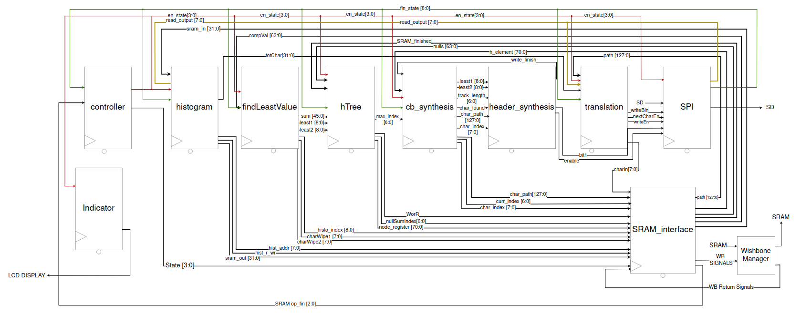

### Compression Module Interaction
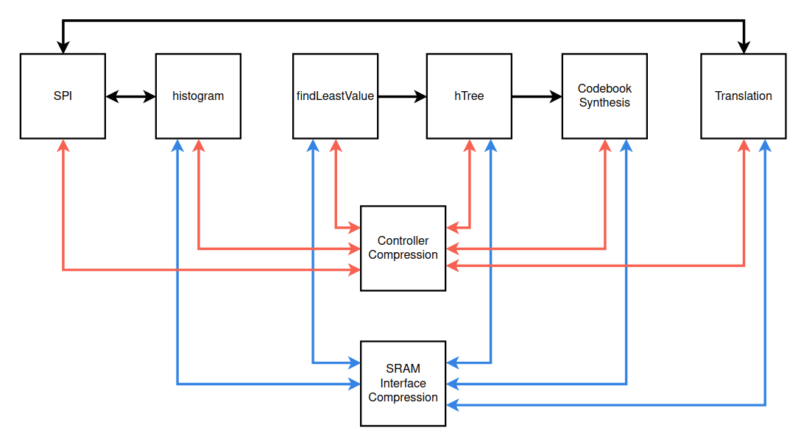

### Decompression Module Interaction
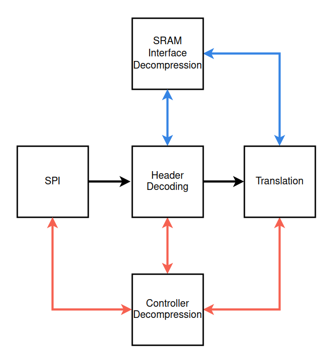

### Controller
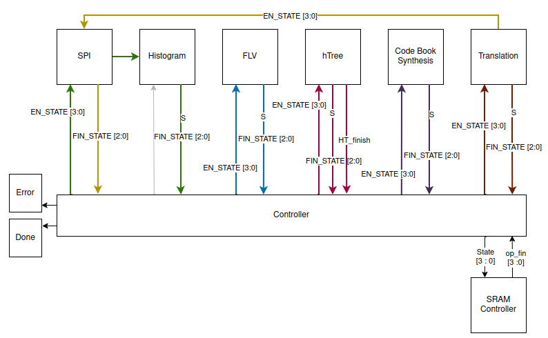
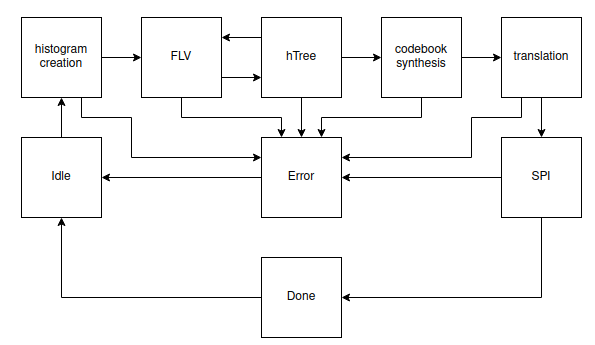

### Histogram
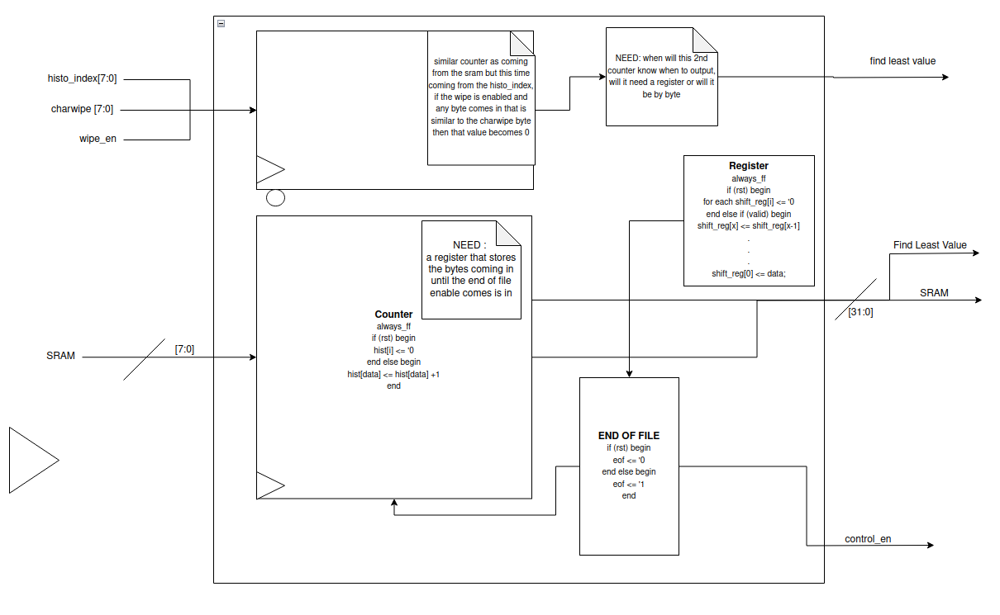

### Find Least Value

### HTREE
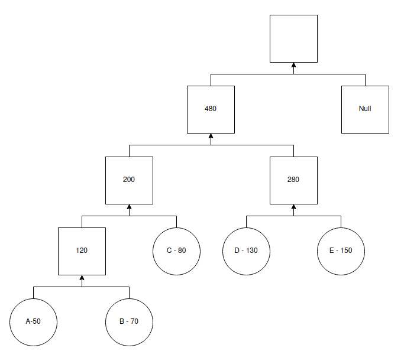
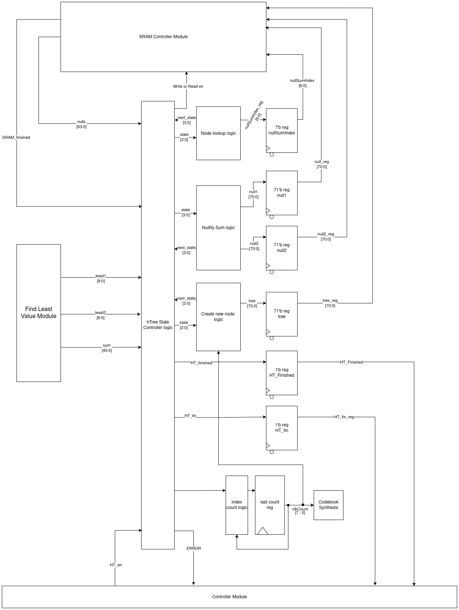

### Codebook Synthesis
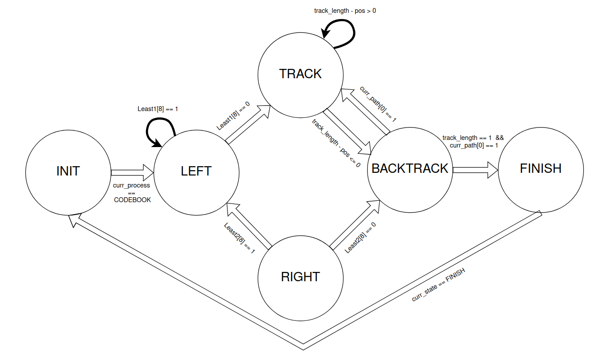
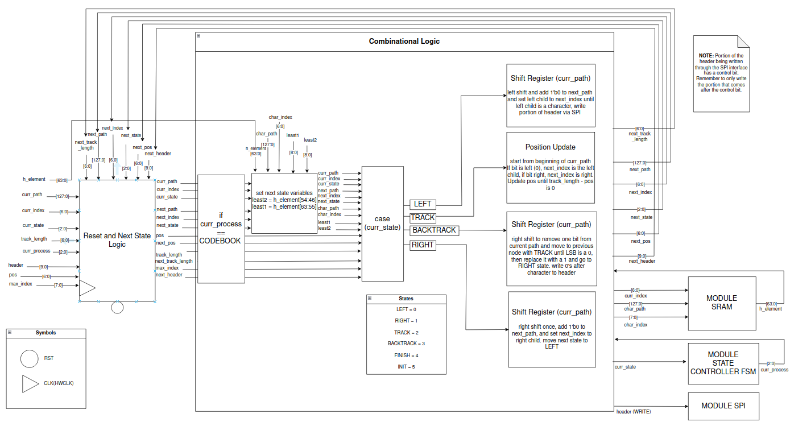

### Header Synthesis
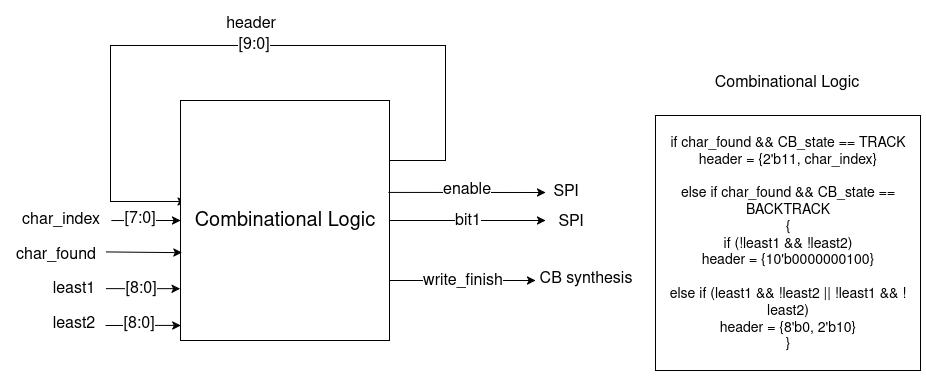

### Translation
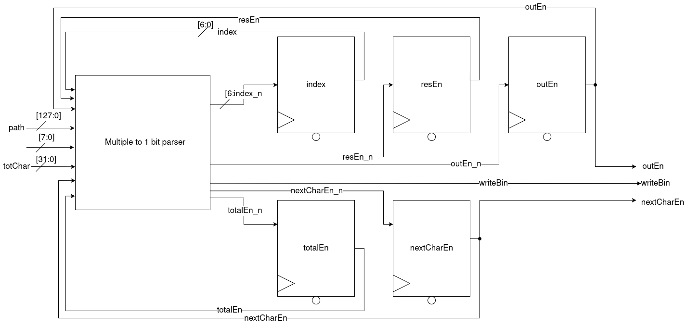

### SRAM Interface
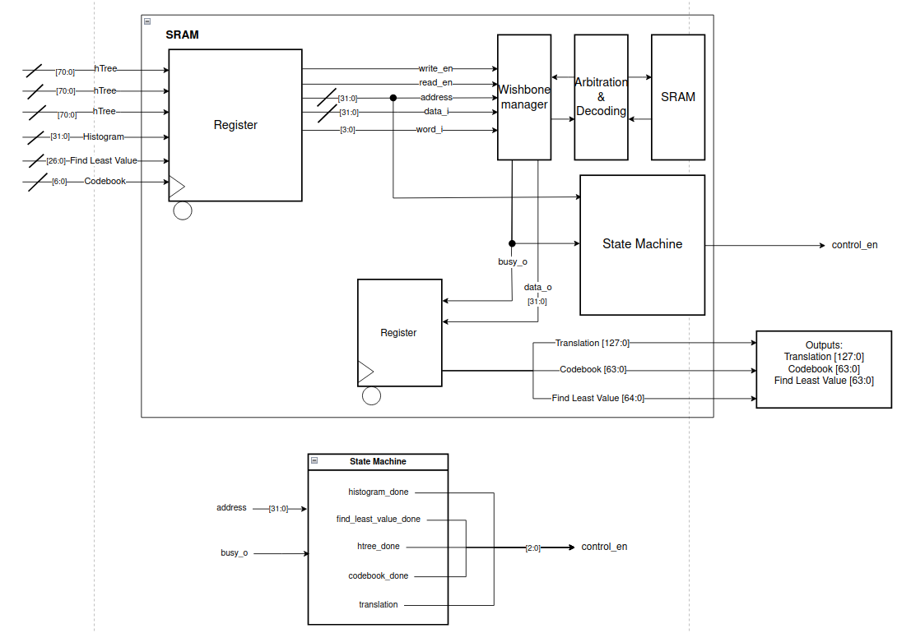

### Header Decode
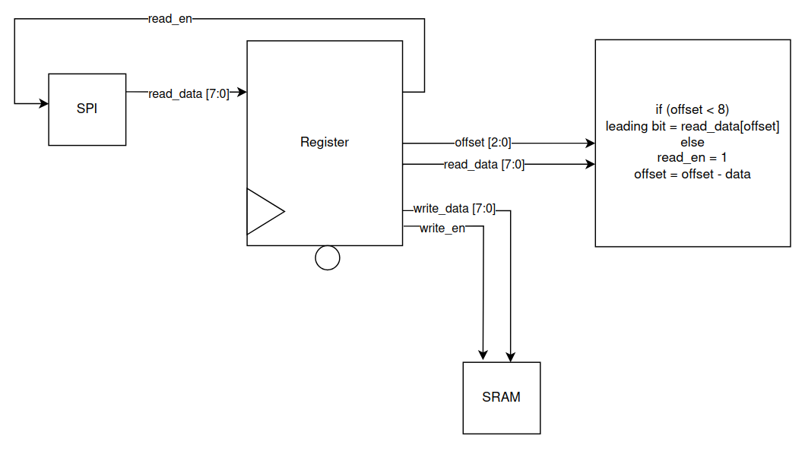

### Translation Decode
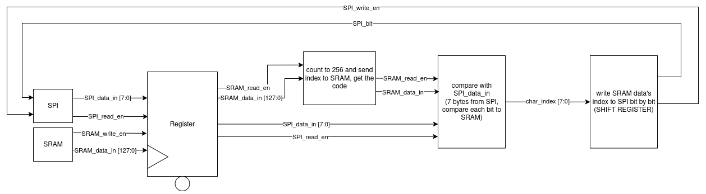