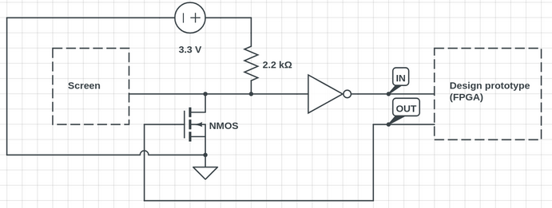
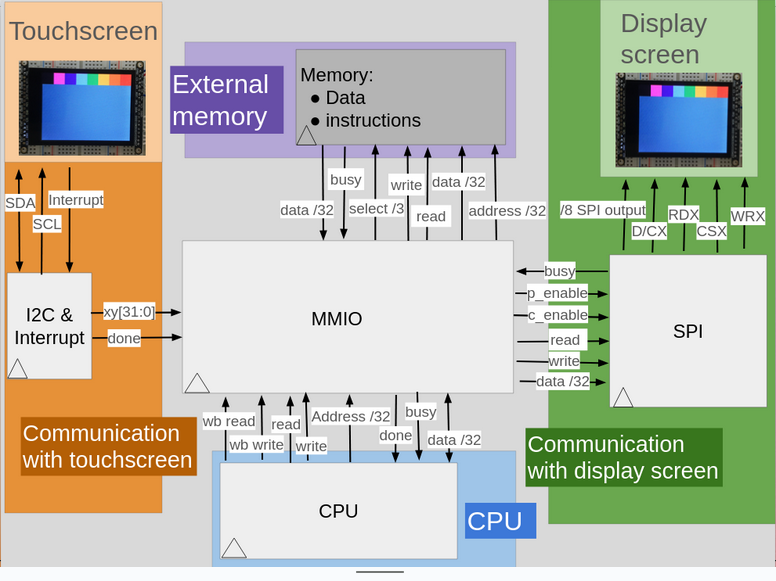
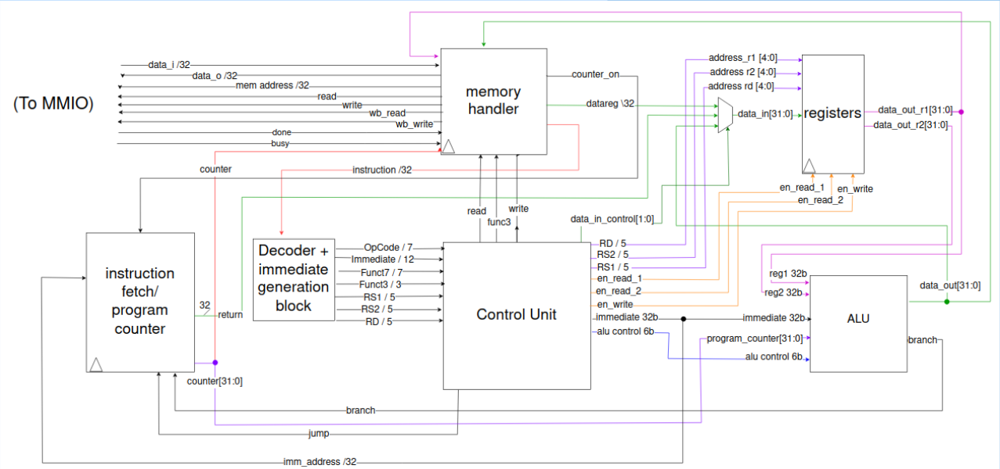
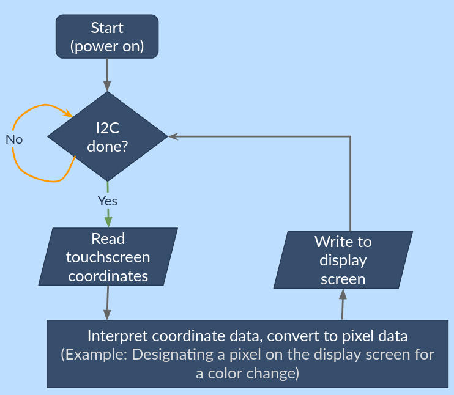

# NEBULA III - Project Documentation

## Team 08 - AZE
* **Peer Mentor:** Andy Hu
* Arina Harlanovich
* Zoe Amerman
* Eileen Koh

## Project Overview
Describe what your project is in 2-3 sentences. Do NOT mention functionality details, you will add those in the *Functionality Description and Testing* section.

## Pin Layout

* **Pin 00 [00]** - input - interrupt from touchscreen 
* **Pin 01 [--]** - NOT ALLOWED
* **Pin 02 [--]** - NOT ALLOWED
* **Pin 03 [--]** - NOT ALLOWED
* **Pin 04 [--]** - NOT ALLOWED
* **Pin 05 [01]** - input and output - SDA, line for I2C with touchscreen 
* **Pin 06 [02]** - input and output - SCL, line for I2C with touchscreen 
* **Pin 07 [03]** - output - SPI D0(7 bit bus data) 
* **Pin 08 [04]** - output - SPI D1 
* **Pin 09 [05]** - output - SPI D2 
* **Pin 10 [06]** - output - SPI D3 
* **Pin 11 [07]** - output - SPI D4 
* **Pin 12 [08]** - output - SPI D5 
* **Pin 13 [09]** - output - SPI D6  
* **Pin 14 [10]** - output - SPI D7 
* **Pin 15 [11]** - output - SPI WR (write clock)
* **Pin 16 [12]** - output - SPI RD (read clock)
* **Pin 17 [13]** - output - SPI CS (chip select, active low)
* **Pin 18 [14]** - output - SPI C/D (data or command signal)
* **Pin 19 [15]** - not used 
* **Pin 20 [16]** - not used 
* **Pin 21 [17]** - not used 
* **Pin 22 [18]** - not used 
* **Pin 23 [19]** - not used 
* **Pin 24 [20]** - not used 
* **Pin 25 [21]** - not used 
* **Pin 26 [22]** - not used 
* **Pin 27 [23]** - not used 
* **Pin 28 [24]** - not used 
* **Pin 29 [25]** - not used
* **Pin 30 [26]** - not used
* **Pin 31 [27]** - not used
* **Pin 32 [28]** - not used
* **Pin 33 [29]** - not used
* **Pin 34 [30]** - not used
* **Pin 35 [31]** - not used
* **Pin 36 [32]** - not used
* **Pin 37 [33]** - not used

## External Hardware
We are using a capacitive touchscreen+display component

Link: https://learn.adafruit.com/adafruit-2-8-and-3-2-color-tft-touchscreen-breakout-v2/overview

To connect screen with the chip, follow the pinmap and conect IM ports of the screen to GND. Here s the picture: 

## Functionality Description and Testing

### I2C
#### Module description
The touchscreen peripheral communicates information about a touch event (most importantly, the coordinates on the screen where the touch occurred) through the I2C communication protocol. The design has a module called t08_I2C_and_interrupt designed for handling this communication with the touchscreen. When a touch event occurs, the screen will send an interrupt signal as an input to the module, and the module will then use I2C to first, specify the address of the screen and the address of a register that it needs to read from within the screen, then second, to read that data. The resultant data is then sent to mmio so that it can be stored in memory.
#### Testing
- I2C has a testbench, with several sets of accompanying enum files for the module's states to make reading the testbench easier.
- If testing on the FPGA without the screen connected, the clock speed can be dramatically reduced so that the I2C process itself can be seen.
- To test with the screen connected though, scl must be at least 10 kHz. Also, a specific setup is needed for the bidirectional pins (sda and scl).

- One means of testing with the screen connected is to display the output data_out, or particularly data_out[27:16] and data_out[11:0] (x-coordinate and y-coordinate) from the module on ss7-ss0. When the module is functional it will update in real time in response to screen touches in a way that makes sense coordinates-wise.
- It can also be tested via oscilloscope using the I2C mode. When the module is functional the oscilloscope can analyze the protocol and report what data is being transferred.

### SPI
#### Module description
CPU communicates with the display through SPI< this module sets up an approopriate format for the display. 
It has two levels of state machine. First, it accepts and registers command and its parameters, then it starts transmitting it to the display.

#### Testbenching
for testing, we send different commands, some with required delay, some with not, and with different amount of parameters

### CPU
#### Instruction fetch/program counter
#### Module description
The module accepts an enable signal from memory handler and increments program counter either by standard '4' or by immediate.

#### Testbenching
Simulates different operations and makes sure program counter increments approopriately

#### Control unit
Decodes/parses instructions and sends relevant information to other modules based on those instructions. 

#### Memory handler

##### Module description
The module send data from the memory and to the memory. It handles all the timing between mmio and cpu by having a state machine with multiple 'wait' states, giving more time for load and store instructions. The last state is a program counter increment enable signal, making sure pc moves on only after we are done transmitting information

##### Testbenching
We test multiple load/ store/ branching operations to make sure CPU doe not skip anythings, correctly recieves information and does not fall behind wishbone manager.

#### MMIO

#### ALU
Performs arithmetic and logical operations on the contents of registers and/or an immediate value and/or the program counter. Evaluates branch conditions.
Testing was done through setting multiple combinations of possible inputs and for each of them, running through every operation and verifying that it gives the correct value. 

#### Registers
A small and very easily accessible memory for the CPU.
Testing was done through making sure that when enable signals are not on, those respective changes (reading = updating output and writing = changing register values) will not occur. It was made sure across several instances that when a value is written to one of the registers, it can later be read back from that register. 

## RTL Diagrams

Overall RTL: 

CPU RTL: 

Operation flowchart: 

